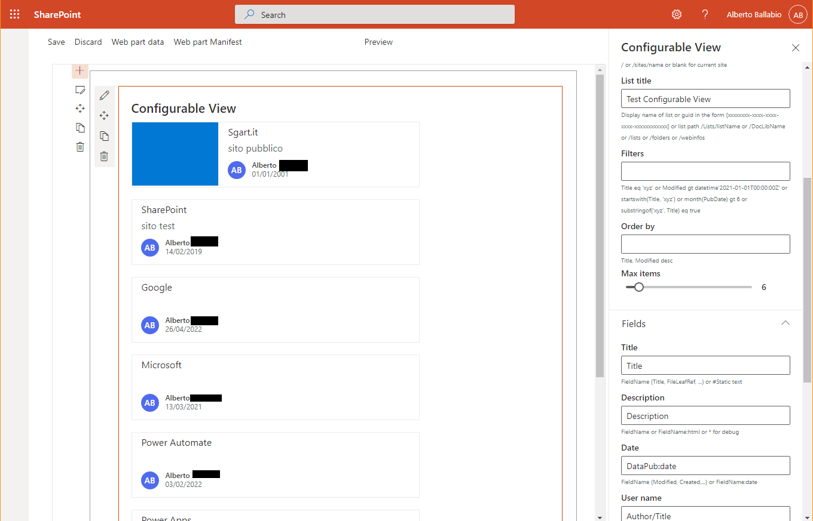
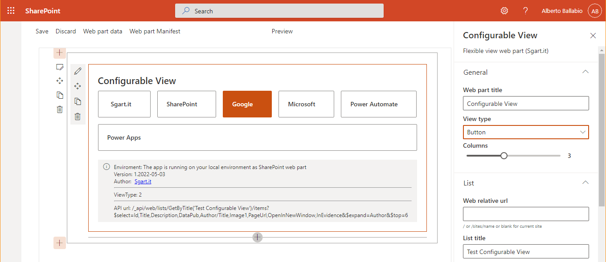
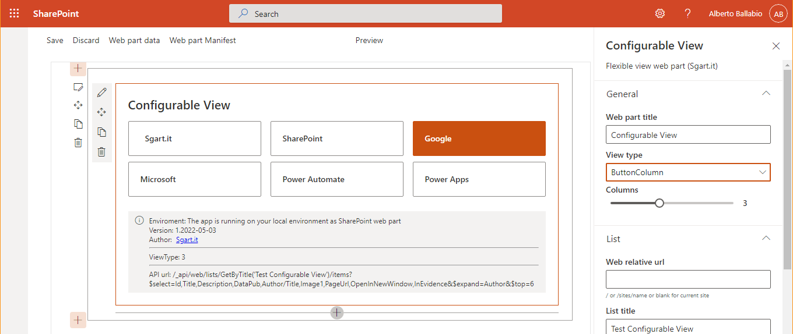
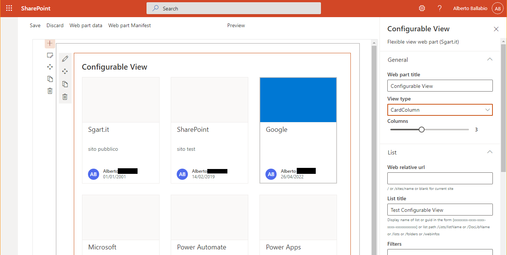
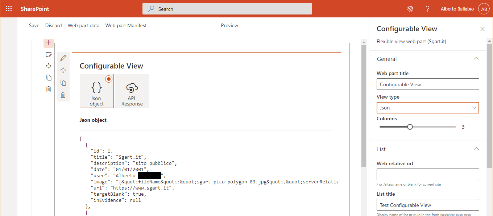
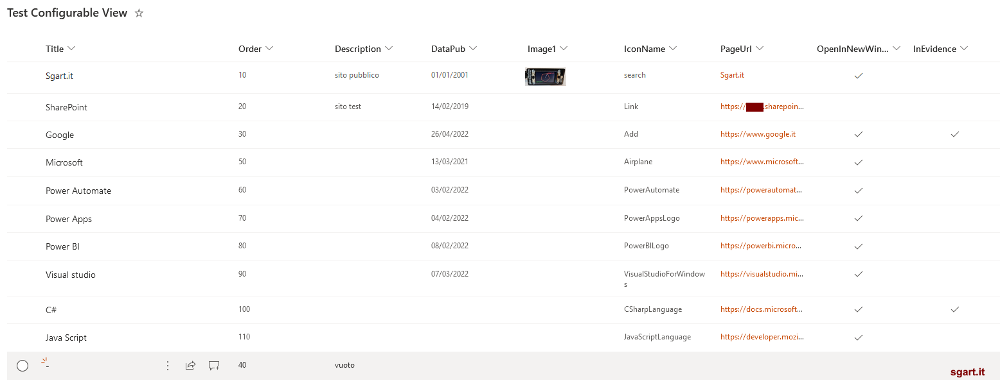

# sgart-spfx-configurable-view-webpart

SPFx configurable view webpart (beta version)

https://www.sgart.it

## install project

node 14.0

npm install gulp-cli yo @microsoft/generator-sharepoint --global

gulp trust-dev-cert

check:

npm list --global --depth=0️

npm 7 se errore 

 ERESOLVE unable to resolve dependency tree 

npm install --save --legacy-peer-deps

## Debug

gulp serve

usare chrome all'indirizzo https://NomeTenant.sharepoint.com/_layouts/15/workbench.aspx

con firefox Warning:

Your web part will not appear in the toolbox. Please make sure "gulp serve" is running in a web part project. Please refresh the page once "gulp serve" is running.
Click here for more information.

## Dati di esempio

Per testare l'esempio creare una lista SharePoint 

- Title (Single line of text)
- Description (Multiple lines of text)
- Image1 (Thumbnail)
- PageUrl (Hyperlink or Picture)
- OpenInNewWindow (Yes/No)
- DataPub (Date and Time)
- InEvidence (Yes/No)
- IconName (Single line of text)
- Order0 (Number)

In ogni caso va bene qualsiasi lista o document library previa configurazione.

## Screenshot

## Deploy
gulp clear; gulp bundle --ship; gulp package-solution --ship

## Used SharePoint Framework Version

## References

- [SharePoint Framework](https://aka.ms/spfx)
- [Microsoft 365 tenant](https://docs.microsoft.com/en-us/sharepoint/dev/spfx/set-up-your-developer-tenant)
- Get your own free development tenant by subscribing to [Microsoft 365 developer program](http://aka.ms/o365devprogram)
- [Getting started with SharePoint Framework](https://docs.microsoft.com/en-us/sharepoint/dev/spfx/set-up-your-developer-tenant)
- [Building for Microsoft teams](https://docs.microsoft.com/en-us/sharepoint/dev/spfx/build-for-teams-overview)
- [Use Microsoft Graph in your solution](https://docs.microsoft.com/en-us/sharepoint/dev/spfx/web-parts/get-started/using-microsoft-graph-apis)
- [Publish SharePoint Framework applications to the Marketplace](https://docs.microsoft.com/en-us/sharepoint/dev/spfx/publish-to-marketplace-overview)
- [SharePoint Framework Overview](https://aka.ms/spfx)
- [Use Microsoft Graph in your solution](https://aka.ms/spfx-yeoman-graph )
- [Build for Microsoft Teams using SharePoint Framework](https://aka.ms/spfx-yeoman-teams) 
- [Build for Microsoft Viva Connections using SharePoint Framework](https://aka.ms/spfx-yeoman-viva)
- [Publish SharePoint Framework applications to the marketplace](https://aka.ms/spfx-yeoman-store)
- [SharePoint Framework API reference](https://aka.ms/spfx-yeoman-api)
- [Microsoft 365 Developer Community](https://aka.ms/m365pnp)
- [Using Office UI Fabric Core and Fabric React in SharePoint Framework](https://docs.microsoft.com/en-us/sharepoint/dev/spfx/office-ui-fabric-integration)
- https://developer.microsoft.com/en-us/fluentui